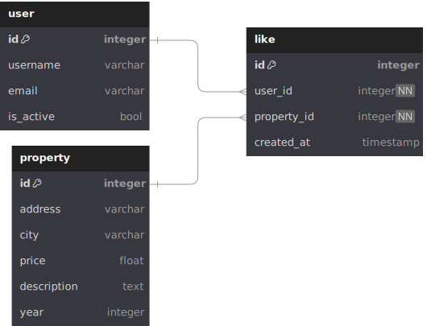
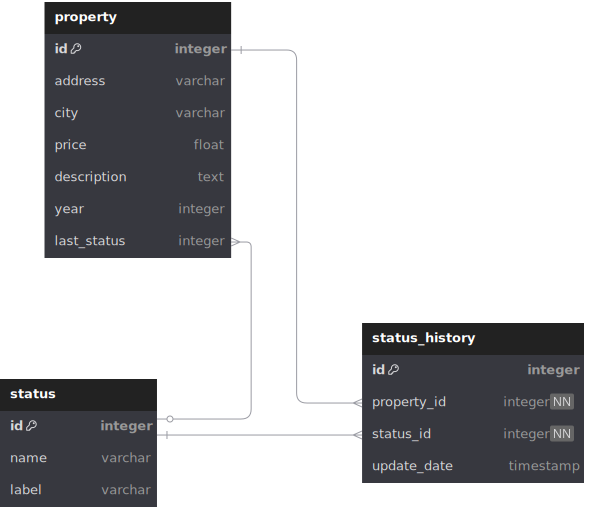

# PythonMicroservices

Este proyecto implementa un microservicio REST desarrollado **sin frameworks** (solo librerías estándar de Python) que se conecta a una base de datos **MySQL** para exponer información de Propiedades.

## 📖 Primer punto - Servicio de consulta

Este microservicio permite realizar operaciones CRUD sobre propiedades inmobiliarias, incluyendo la posibilidad de filtrar resultados por diferentes criterios como año, ciudad y estado.

## 🧰 Tecnologías utilizadas

| Tecnología                | Propósito                           |
| -------------------------- | ------------------------------------ |
| Python 3                   | Lenguaje de programación principal  |
| `http.server`            | Servidor HTTP minimalista            |
| `mysql-connector-python` | Cliente oficial de MySQL para Python |
| MySQL                      | Base de datos relacional             |


## 📁 Estructura del proyecto

pythonmicroservices/  
├── database/  
│   ├── config.py # Configuración de la base de datos  
│   └── db.py # Conexión a la base de datos  
├── mylib/  
│   └── queries.py # Consultas a la base de datos  
├── tests/  
│   ├── test_db.py # Pruebas de conexión a la base de datos  
│   └── test_main.py # Pruebas del servidor HTTP  
├── requirements.txt # Dependencias del proyecto  
└── Makefile # Archivo para automatizar tareas  
└── main.py # Punto de entrada del microservicio  

## Documentación de la API
### Endpoints
| Método | Endpoint                | Descripción                                      |
| ------ | ----------------------- | ------------------------------------------------ |
| GET    | /properties/             | Obtiene todas las propiedades                   |
| GET    | /properties/?year={year} | Filtra propiedades por año                      |
| GET    | /properties/?city={city} | Filtra propiedades por ciudad                   |
| GET    | /properties/?status={status} | Filtra propiedades por estado                   |

### Ejemplo de uso
Para obtener todas las propiedades, realiza una solicitud GET a:

```python
import requests

# Obtener todas las propiedades
url = "http://localhost:8000/properties/"

# Filtrar propiedades por año
url = "http://localhost:8000/properties/?year=2023"

# Filtrar propiedades por ciudad
url = "http://localhost:8000/properties/?city=bogota"

# Filtrar propiedades por estado
url = "http://localhost:8000/properties/?status=en_venta"

response = requests.get(url)
```

JSON de respuesta:

```json
[
    {
        "id": 2,
        "address": "carrera 100",
        "city": "bogota",
        "price": 150000000,
        "description": "Descripción de la propiedad 2",
        "status": "en_venta"
    },
    {
        "id": 5,
        "address": "carrera 50",
        "city": "medellin",
        "price": 125000000,
        "description": "Descripción de la propiedad 5",
        "status": "pre_venta"
    },
]
```

## 🔌 Requisitos previos

- Python 3.10 o superior
- MySQL (8.x recomendado)
- Instalar dependencias:

```bash
make install
```

## 🏃 Ejecución

Para ejecutar el microservicio, utiliza el siguiente comando:

```bash
python main.py
```

## 🧪 Pruebas

Para ejecutar las pruebas, utiliza el siguiente comando:

```bash
make test
```

## 🛠️ Mantenimiento

Para ejecutar el formateador de código, utiliza el siguiente comando:

```bash
make format
```

Para ejecutar el linter, utiliza el siguiente comando:

```bash
make lint
```

## 📖 Segundo punto - Servicio de "Me gusta"

Para implementar el servicio de "Me gusta", se crearía una nueva tabla en la base de datos para almacenar los "likes" de los usuarios sobre las propiedades. Con esta tabla, se podría registrar qué usuario ha dado "me gusta" a qué propiedad, permitiendo así que los usuarios puedan interactuar con las propiedades de una manera más social. Igualmente, se podrían implementar endpoints para que los usuarios puedan dar "me gusta" a una propiedad y consultar cuántos "me gusta" tiene cada propiedad.

#### SQL para crear la tabla de "like"

```sql
CREATE TABLE like (
    id INT AUTO_INCREMENT PRIMARY KEY,
    property_id INT NOT NULL,
    user_id INT NOT NULL,
    created_at TIMESTAMP DEFAULT CURRENT_TIMESTAMP,
    FOREIGN KEY (property_id) REFERENCES property(id),
    FOREIGN KEY (user_id) REFERENCES auth_user(id)
);

```

#### Propuesta MER



## 📖 Puntos extra - Pruebas unitarias TDD

Para implementar pruebas unitarias siguiendo el enfoque TDD (Test-Driven Development), se deben crear pruebas antes de desarrollar las funcionalidades. Esto implica definir los casos de prueba para las operaciones CRUD y los filtros, y luego implementar el código necesario para que estas pruebas pasen. Los tests se encuentran en la carpeta `tests/` y se pueden ejecutar utilizando el comando `make test`.

### Ejemplo de prueba unitaria para el endpoint de propiedades

```python
import unittest
...

class TestServer(unittest.TestCase):

    @classmethod
    def setUpClass(cls):
        """Start the server before running tests."""
        cls.server = subprocess.Popen(["python", "main.py"])
        time.sleep(1)

    @classmethod
    def tearDownClass(cls):
        """Terminate the server after tests are done."""
        cls.server.terminate()

    def test_get_properties_return_200(self):
        """Test that the properties endpoint returns a 200 status code."""
        response = requests.get(f"{BASE_URL}/properties/")
        self.assertEqual(response.status_code, 200)
        self.assertIsInstance(response.json(), list)

    ...
```

## 📖 Puntos extra - Propuesta de nuevo MER

Para el nuevo MER, se propone una nueva relación entre las tablas "property" y "status", teniendo un nuevo campo llamado "last_status", con el cual se puede rastrear el último estado de la propiedad. Esto permite un mejor rendimiento en las consultas al momento de saber el estado actual de la propiedad sin necesidad de consultar la tabla de historial. Este campo se actualizaría cada vez que se cambie el estado de la propiedad.

#### SQL para crear el nuevo campo "last_status"

```sql
ALTER TABLE property
ADD COLUMN last_status INT DEFAULT NULL;

ALTER TABLE property
ADD CONSTRAINT fk_last_status FOREIGN KEY (last_status) REFERENCES status(id);
```

#### Propuesta MER actualizado


## 📖 Segundo ejercicio - myArray

```python
import random
import logging

# Configure logging
logging.basicConfig(level=logging.INFO, format="%(message)s")

# Generate a random array of integers between 0 and 9
ARRAY_LENGTH = 15
MY_ARRAY = [random.randint(0, 9) for _ in range(ARRAY_LENGTH)]


def myBlocks(arr: list[int]) -> list[list[int] | list[str]]:
	separated_lists = []

	for _ in range(arr.count(0) + 1):
		try:
			# Find the index of the first zero in the array
			zero_index = arr.index(0)
		except ValueError:
			# If no zero is found, treat the rest of the array as a single block
			zero_index = len(arr)
		# Append the sorted sub-array before the zero, or "X" if empty
		separated_lists.append(sorted(arr[:zero_index]) if arr[:zero_index] else ["X"])
		# Remove the processed part of the array
		arr = arr[zero_index + 1 :]

	return " ".join("".join(map(str, lst)) for lst in separated_lists)


logging.info("Generated Array: %s", MY_ARRAY)
logging.info("Blocks: %s", myBlocks(MY_ARRAY))

# Output example
# Generated Array: [3, 0, 1, 4, 0, 2, 5, 0, 6, 7, 8, 9, 0, 1, 2]
# Blocks: 3 14 25 6789 12
```

#### Ejecutar el código

El archivo `my_array.py` contiene el código para generar un arreglo aleatorio y separar sus bloques. Puedes cambiar el tamaño del arreglo modificando la constante `ARRAY_LENGTH`. Para ejecutar el código, asegúrate de tener Python instalado y ejecuta el siguiente comando en tu terminal:

```bash
python my_array.py
```
